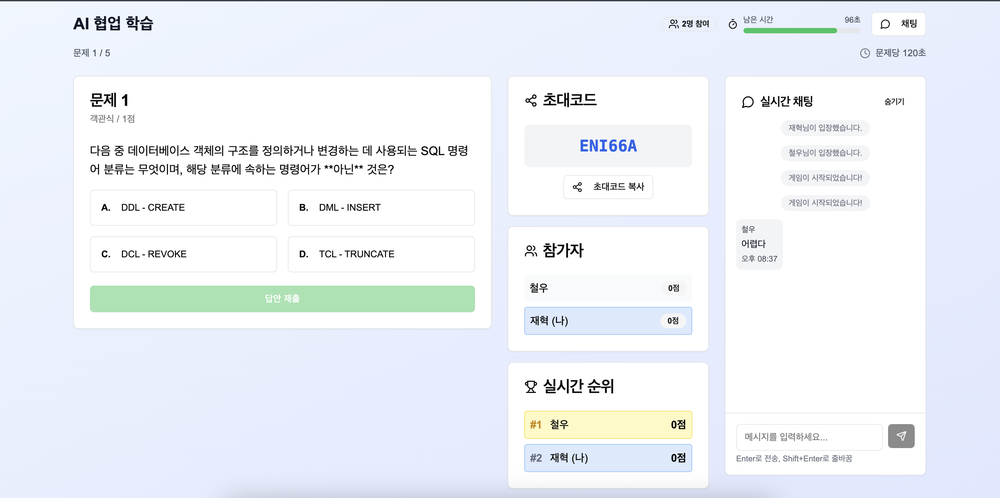

<div align="center">
  
  <h1>L2Q</h1>
  <a href="https://vibe-front.vercel.app">https://vibe-front.vercel.app</a>
  <p><strong>실시간 소통으로 함께 성장하는 스터디 플랫폼</strong></p>
  <p>L2Q는 사용자들이 스터디 룸을 만들고 참여하여 함께 공부하고 지식을 공유할 수 있는 웹 애플리케이션입니다.</p>
</div>

<br />

## ✨ 주요 기능

- **스터디 룸 생성 및 참여**: 원하는 주제의 스터디 룸을 자유롭게 만들고 참여할 수 있습니다.
- **실시간 채팅**: WebSocket을 기반으로 한 실시간 소통 기능을 제공합니다.
- **질의응답**: 스터디 중 궁금한 점을 질문하고 답변하며 지식을 나눕니다.

<br />

## 📸 스크린샷

<!-- 여기에 애플리케이션 스크린샷을 추가하세요. -->
<div align="center">
  
</div>

<br />

## 🚀 시작하기

### 사전 요구 사항

- [Node.js](https://nodejs.org/en/) (v20.x)
- [pnpm](https://pnpm.io/installation)

### 설치 및 실행

1. **저장소 복제**

   ```bash
   git clone https://github.com/your-username/vibe-front.git
   cd vibe-front
   ```

2. **의존성 설치**

   ```bash
   pnpm install
   ```

3. **개발 서버 실행**
   ```bash
   pnpm dev
   ```
   브라우저에서 [http://localhost:3000](http://localhost:3000)으로 접속하세요.

### 기타 스크립트

- **프로덕션 빌드**: `pnpm build`
- **프로덕션 서버 시작**: `pnpm start`
- **린트 검사**: `pnpm lint`

<br />

## 🛠️ 기술 스택

- **프레임워크**: [Next.js](https://nextjs.org/)
- **언어**: [TypeScript](https://www.typescriptlang.org/)
- **스타일링**: [Tailwind CSS](https://tailwindcss.com/), [shadcn/ui](https://ui.shadcn.com/)
- **상태 관리**: React Hooks & Context API
- **폼**: [React Hook Form](https://react-hook-form.com/), [Zod](https://zod.dev/)
- **실시간 통신**: [StompJS](https://stomp-js.github.io/), [Socket.IO](https://socket.io/)
- **배포**: [Vercel](https://vercel.com/)

<br />

## 📁 프로젝트 구조

```
vibe-front/
├── app/                  # 라우팅 및 페이지 컴포넌트
├── components/           # 공통 UI 컴포넌트
│   ├── ui/               # shadcn/ui 컴포넌트
│   └── ...
├── hooks/                # 커스텀 훅
├── lib/                  # 유틸리티 함수
├── public/               # 정적 에셋 (이미지, 폰트 등)
├── styles/               # 전역 스타일
└── ...
```
